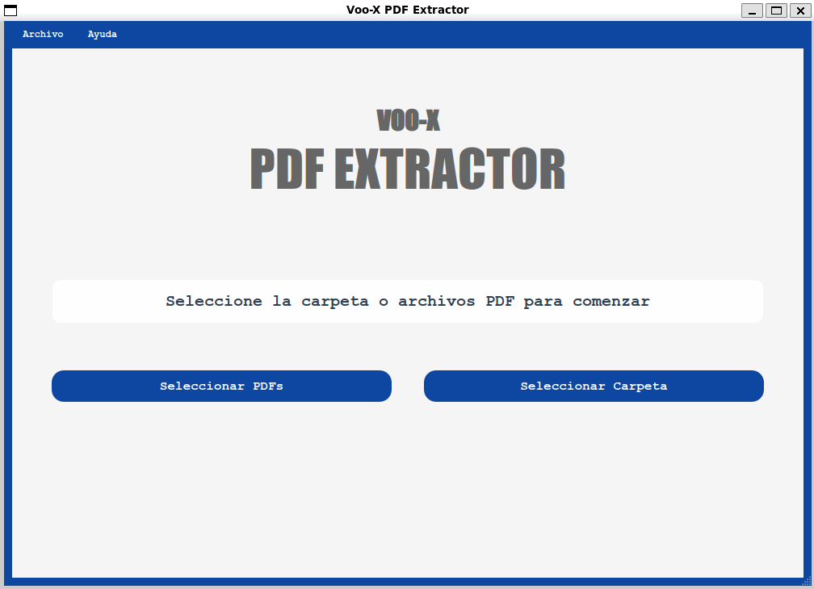
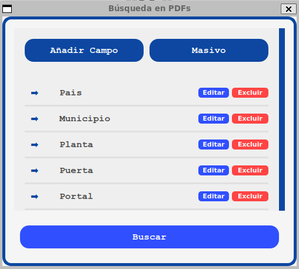
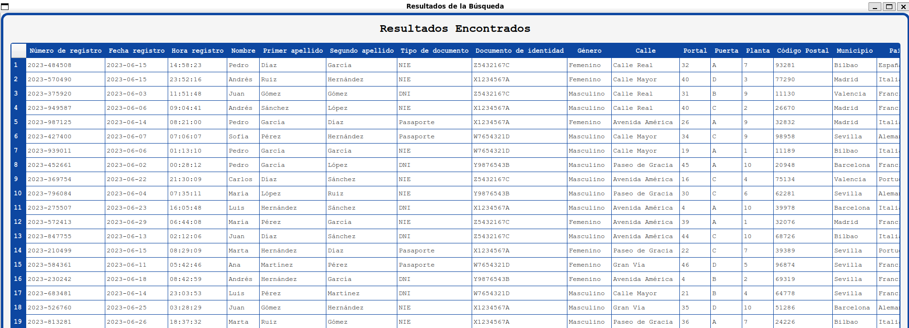

# VOO-X PDF Extractor

Una aplicación de escritorio para extraer información específica de múltiples archivos PDF y exportarla a CSV.

## Objetivo del Proyecto

Brindar una solución eficiente y amigable para la extracción masiva de datos de PDFs, permitiendo ahorrar tiempo y reducir errores en procesos manuales.

## Características

### Interfaz Principal

* Diseño moderno con título "VOO-X PDF EXTRACTOR"
* Menú superior con opciones de Archivo y Ayuda
* Área central para selección de archivos
* Barra de estado para mensajes informativos
* Scroll vertical con diseño personalizado



### Selección de Archivos

* Botón "Seleccionar PDFs" para elegir archivos individuales
* Botón "Seleccionar Carpeta" para procesar una carpeta completa
* Visualización del número de archivos seleccionados
* Soporte para múltiples archivos PDF

### Búsqueda en PDFs

* Ventana dedicada para configurar términos de búsqueda
* Dos métodos de entrada de términos:
  * Manual: Botón "Añadir Campo" para agregar términos uno a uno
  * Masivo: Importación desde archivo Excel (primera columna)
* Edición y exclusión de términos de búsqueda
* Interfaz con scroll para manejar múltiples términos
* Separadores visuales entre términos
* Confirmación de términos con tecla Enter o botón de confirmación



### Resultados

* Ventana de resultados con tabla de datos extraídos
* Columnas organizadas por términos de búsqueda
* Botón "Exportar a CSV" para guardar resultados
* Botón "Ver Tabla" para revisar últimos resultados
* Soporte para maximizar/minimizar la ventana de resultados



### Características Adicionales

* Estilos personalizados con colores corporativos
* Fuentes personalizadas para mejor legibilidad
* Mensajes de error y confirmación
* Interfaz responsiva y amigable
* Soporte para archivos Excel (.xlsx, .xls) en importación masiva

## Requisitos

* Python 3.x
* PySide6 (Qt para Python)
* pdfplumber
* pandas
* openpyxl

## Instalación

1. Descargar el ejecutable:
   * Descargue el archivo `VOO-X PDF Extractor.exe` desde la [página de releases](https://github.com/MouraAnalyst/pdf-extractor/releases)
   * Ejecute el archivo descargado para usar la aplicación directamente

2. Desde el código fuente:
   ```bash
   git clone git@github.com:MouraAnalyst/pdf-extractor.git
   ```

3. Instalar las dependencias (solo si instala desde código fuente):
   ```bash
   pip install PySide6 pdfplumber pandas openpyxl
   ```

## Uso

1. Ejecutar la aplicación:
   ```bash
   python src/main.py
   ```
2. Seleccionar archivos PDF usando los botones de la interfaz
3. Configurar términos de búsqueda (manual o masivamente desde Excel)
4. Procesar los PDFs
5. Exportar resultados a CSV si se desea

## Estructura del Proyecto

```
src/
├── main.py                        # Punto de entrada de la aplicación
├── pdf_processor/                 # Módulo para procesamiento de PDFs
│   └── pdf_extractor.py           # Lógica de extracción de datos
└── ui/                            # Interfaz de usuario
    ├── main_window.py             # Ventana principal
    ├── styles/                    # Estilos de la aplicación
    │   └── style.py               # Definiciones de estilos
    └── dialogs/                   # Ventanas de diálogo
        ├── search_dialog.py       # Diálogo de búsqueda
        ├── results_dialog.py      # Diálogo de resultados
        └── excel_import_dialog.py # Diálogo de importación Excel
```

## Pruebas

1. Asegúrese de que las dependencias están instaladas
2. Ejecute los tests ubicados en `tests_/`
3. Utilice los PDFs de prueba incluidos en `tests_/PDFs` para validar la funcionalidad

> **Nota**: Los archivos PDF en la carpeta `tests_/PDFs` contienen datos personales ficticios creados específicamente para pruebas. No contienen información real de ninguna persona.

## Futuras Mejoras

* Implementación de IA para mejorar la extracción de datos en PDFs basados en imágenes
* Soporte para más formatos de archivo (e.g., JSON, XML)
* Función de previsualización de PDFs procesados

## Historial de Cambios

### Versión 1.1.0
* Añadido soporte para añadir campos de forma masiva con archivo excel
* Mejorada la interfaz gráfica
* Corregidos errores en la exportación a CSV

### Versión 1.0.0
* Versión inicial con extracción de datos desde PDFs y exportación a CSV

## Licencia

Este proyecto está licenciado bajo la Licencia MIT. Consulte el archivo LICENSE para más detalles.

## Contribuciones

1. Haga un fork del repositorio
2. Cree una rama para su funcionalidad:
   ```bash
   git checkout -b feature/nueva-funcionalidad
   ```
3. Haga un pull request con sus cambios